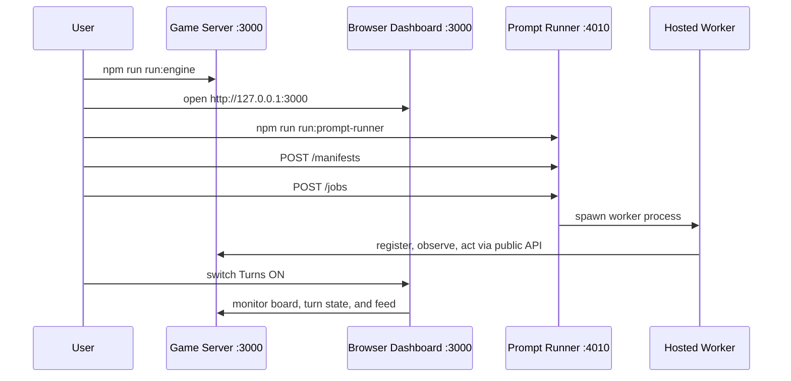

# Prompt Runner Demo

Use this when you want to demonstrate the hosted prompt-agent path end to end.

If you want the services started for you, use:

```bash
npm run run:demo:prompt-runner
```

That command starts the game server and prompt runner, then prints the exact PowerShell commands to upload the example manifest and create a hosted job.

If you want the example manifest upload and hosted job creation handled automatically, use:

```bash
npm run run:demo:prompt-runner -- --auto
```

That mode starts the same services, uploads the example manifest, creates the hosted job automatically, and prints the resulting job status.

The core idea is simple:

1. start the game server first
2. open the built-in dashboard at `http://127.0.0.1:3000`
3. start prompt runner
4. upload a prompt manifest
5. create a hosted job that attaches to the server
6. switch `Turns ON` in the dashboard

## Flow Diagram



## What This Demo Proves

It shows that prompt runner is not the game.

It is a control plane that runs hosted prompt-defined agents against the real game server.

## Prerequisites

- Node.js 22+
- npm 10+
- Go available for the local server
- one model profile that prompt runner can actually resolve

You already have example assets in this repo:

- manifest example: [PROMPT_MANIFEST.example.json](PROMPT_MANIFEST.example.json)
- profile example: [PROMPT_RUNNER_PROFILES.example.json](PROMPT_RUNNER_PROFILES.example.json)

## Choose A Model Profile Path

### Option A: OpenAI-compatible hosted demo

Use the existing `balanced-production` profile and make sure `OPENAI_API_KEY` is set.

### Option B: Local Ollama demo

Use the `local-ollama` profile from [PROMPT_RUNNER_PROFILES.example.json](PROMPT_RUNNER_PROFILES.example.json) and make sure your local Ollama-compatible endpoint is running.

If you use Option B, edit the example manifest so `model.selection.profile` is `local-ollama` before uploading it.

## Step-By-Step Local Demo

## Fastest Demo Modes

1. `npm run run:demo:prompt-runner`
   Starts the server and prompt runner, then prints the exact commands you run in a second terminal.

2. `npm run run:demo:prompt-runner -- --auto`
   Starts the server and prompt runner, uploads the example manifest, creates the hosted job automatically, and prints the job status.

Use `--auto` when you want the least confusing first-run demo.

## Step-By-Step Local Demo

### 1. Install dependencies

```bash
npm install
```

### 2. Start the game server

```bash
npm run run:engine
```

### 3. Open the built-in dashboard

```text
http://127.0.0.1:3000
```

Leave `Turns OFF` for now so the worker can attach first.

### 4. Configure prompt runner profiles

PowerShell example:

```powershell
$env:PROMPT_RUNNER_MODEL_PROFILES_FILE = "docs/PROMPT_RUNNER_PROFILES.example.json"
```

If you are using the OpenAI-backed example profile, also set:

```powershell
$env:OPENAI_API_KEY = "your-key-here"
```

### 5. Start prompt runner

```bash
npm run run:prompt-runner
```

The control plane listens on `http://127.0.0.1:4010` by default.

### 6. Upload the example manifest

PowerShell example:

```powershell
Invoke-RestMethod -Method Post -Uri http://127.0.0.1:4010/manifests -ContentType "application/json" -InFile docs/PROMPT_MANIFEST.example.json
```

### 7. Create a hosted job against the local game server

PowerShell example:

```powershell
$body = @'
{
  "manifestId": "treasure-mind",
  "connection": {
    "baseUrl": "http://127.0.0.1:3000"
  },
  "hero": {
    "name": "Hosted Treasure Mind"
  },
  "requestedBy": "demo-operator"
}
'@

Invoke-RestMethod -Method Post -Uri http://127.0.0.1:4010/jobs -ContentType "application/json" -Body $body
```

### 8. Inspect job status

```powershell
Invoke-RestMethod -Uri http://127.0.0.1:4010/jobs
```

### 9. Go back to the dashboard and switch `Turns ON`

At that point you should see the hosted worker behave like any other hero attached to the board.

## How To Explain This To Users

Use this exact framing:

1. start the server
2. open `http://127.0.0.1:3000`
3. either run a direct bot client or start prompt runner and submit a hosted prompt job

That is the correct product boundary.

## Recommended Doc Boundary

- [START_HERE.md](START_HERE.md): what to start first and what each component is
- [QUICKSTART.md](QUICKSTART.md): command-first local client recipes
- [PROMPT_RUNNER_DEMO.md](PROMPT_RUNNER_DEMO.md): end-to-end hosted prompt demo
- [DASHBOARD_STANDALONE.md](DASHBOARD_STANDALONE.md): optional separate UI hosting only
- [HOSTED_PROMPT_RUNNER.md](HOSTED_PROMPT_RUNNER.md): control-plane reference details
