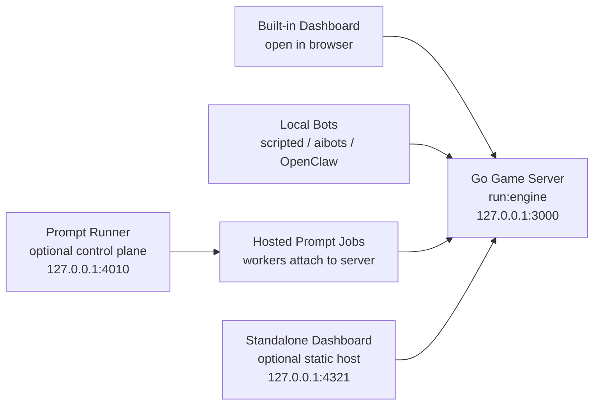

# Start Here

This repo is easier to understand if you start from one rule:

`http://127.0.0.1:3000` is the default local game.

When you run the server locally:

1. the Go engine is the game
2. `http://127.0.0.1:3000` is the built-in dashboard for that game
3. bots and hosted prompt jobs are separate clients that attach to that server

If you only want to run the game locally, you can ignore the standalone dashboard and prompt runner at first.

## The Simple Mental Model



## Default Local Flow

Use this if your goal is just to start a game and watch it.

1. install dependencies
2. start the server
3. open `http://127.0.0.1:3000`
4. attach one bot family
5. switch `Turns ON`

Commands:

```bash
npm install
npm run run:engine
```

Then open:

```text
http://127.0.0.1:3000
```

Then choose one client path:

- scripted bot: `npx cross-env NEURAL_NECROPOLIS_SERVER_URL=http://127.0.0.1:3000 npm run run:scripted:bot:berserker`
- AI bot: `npx cross-env NEURAL_NECROPOLIS_SERVER_URL=http://127.0.0.1:3000 npm run run:aibots:bot`
- OpenClaw persistent worker: `npx cross-env NEURAL_NECROPOLIS_SERVER_URL=http://127.0.0.1:3000 OPENCLAW_AGENT_LOCAL=1 npm run run:openclaw:bot -- --session crypt-ash --slug crypt-ash --persona scout`
- prompt runner hosted job: see [PROMPT_RUNNER_DEMO.md](PROMPT_RUNNER_DEMO.md)

If you want a one-command local demo instead of starting pieces yourself:

- `npm run run:demo:local`: starts the server and a small scripted bot mix
- `npm run run:demo:prompt-runner`: starts the server and prompt runner, then prints the exact hosted demo commands
- `npm run run:demo:prompt-runner -- --auto`: starts the server and prompt runner, uploads the example manifest, creates the hosted job automatically, and prints the job status

## Do You Need The Standalone Dashboard?

Usually, no.

If you are already using `http://127.0.0.1:3000`, you are already using the dashboard that matters for local play.

The standalone dashboard exists for a different deployment shape:

1. host the UI separately from the Go binary
2. point that UI at a remote server with `?server=...`
3. keep the browser UI deployable on a different origin

Local development value:

- lets you test the extracted UI package by itself
- lets you verify cross-origin admin/dashboard behavior
- lets you deploy the UI independently later

If you do not need separate UI hosting, treat it as optional infrastructure and ignore it.

Use this only when you intentionally want a second UI host:

```bash
npm run run:engine
npm run run:dashboard:serve
```

Then open:

```text
http://127.0.0.1:4321/?server=http://127.0.0.1:3000
```

## Do You Need Prompt Runner?

Only if you want hosted prompt-defined agents.

Prompt runner does not replace the game server. It is a separate service that:

1. stores reviewed prompt manifests
2. creates jobs
3. starts workers that attach to the game server through the public API

The built-in dashboard now includes a `Hosted Agents` tab for this flow, so you can draft a prompt, store the manifest, launch the hosted job, and inspect logs in the browser while the game stays visible at `:3000`.

So the order is always:

1. start the server
2. open `:3000`
3. either run bots directly or run prompt runner and submit a hosted job

For the step-by-step hosted flow, use [PROMPT_RUNNER_DEMO.md](PROMPT_RUNNER_DEMO.md).
