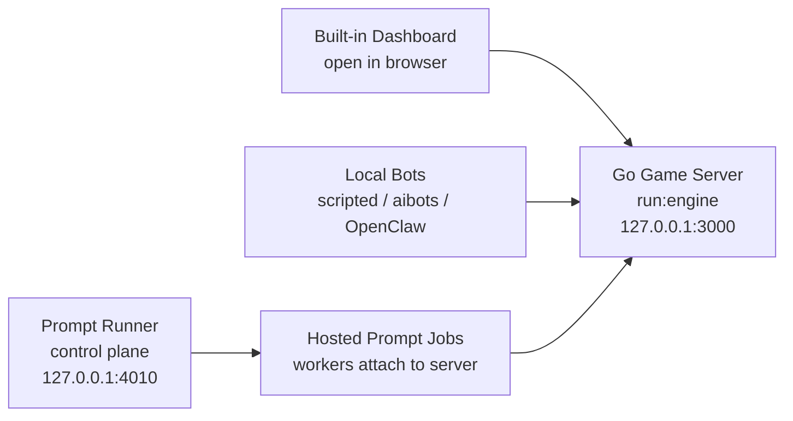

# Start Here

## System Components

Neural Necropolis has a few moving parts. Here is what each one does:

| Component          | What it is                                                                                                                                | Default address                          | When you need it                                      |
| ------------------ | ----------------------------------------------------------------------------------------------------------------------------------------- | ---------------------------------------- | ----------------------------------------------------- |
| **Game Engine**    | The authoritative Go server. Runs the dungeon, enforces rules, progresses turns. Also serves the embedded React dashboard.                | `http://127.0.0.1:3000`                  | Always — this is the game.                            |
| **Dashboard**      | The browser-based React UI embedded in the engine. Shows the map, hero details, hosted agent builder, completed boards, and all controls. | `http://127.0.0.1:3000` (same as engine) | Always — just open the engine URL.                    |
| **Prompt Runner**  | A separate control-plane service that stores prompt manifests, launches hosted agent workers, and manages their lifecycle.                | `http://127.0.0.1:4010`                  | When you want AI-powered hosted agents.               |
| **Hosted Workers** | Processes spawned by prompt runner that register a hero and play the game via the public API using an LLM.                                | — (managed by prompt runner)             | Spawned automatically when you launch a hosted agent. |
| **Local Bots**     | Standalone bot processes (scripted, AI, OpenClaw) that attach directly to the server.                                                     | — (separate terminal)                    | Optional alternative to hosted agents.                |

The **recommended first experience** is: start the engine, open the dashboard, start prompt runner, and build + launch a hosted agent from the dashboard UI.

## The Simple Mental Model



## Default Local Flow

Use this if your goal is just to start a game and watch it.

1. install dependencies
2. start the server
3. open `http://127.0.0.1:3000`
4. attach one bot family
5. switch `Turns ON`

Commands:

```bash
npm install
npm run run:engine
```

Then open:

```text
http://127.0.0.1:3000
```

Then choose one client path:

- scripted bot: `npx cross-env NEURAL_NECROPOLIS_SERVER_URL=http://127.0.0.1:3000 npm run run:scripted:bot:berserker`
- AI bot: `npx cross-env NEURAL_NECROPOLIS_SERVER_URL=http://127.0.0.1:3000 npm run run:aibots:bot`
- OpenClaw persistent worker: `npx cross-env NEURAL_NECROPOLIS_SERVER_URL=http://127.0.0.1:3000 OPENCLAW_AGENT_LOCAL=1 npm run run:openclaw:bot -- --session crypt-ash --slug crypt-ash --persona scout`
- **hosted prompt job**: see the next section

If you want a one-command local demo instead of starting pieces yourself:

- `npm run run:demo:local`: starts the server and a small scripted bot mix
- `npm run run:demo:prompt-runner`: starts the server and prompt runner, then prints the exact hosted demo commands
- `npm run run:demo:prompt-runner -- --auto`: starts the server and prompt runner, uploads the example manifest, creates the hosted job automatically, and prints the job status

## Hosted Prompt: From Clone To First Run

This is the recommended entry point if you want to command a hero through a prompt-defined agent. It covers the full path from downloading the repo to running your first hosted prompt.

### 1. Clone and install

```bash
git clone <repo-url>
cd neural-necropolis
npm install
```

### 2. Set up your API key

Create a `.env` file in the repo root with your model provider key:

```env
# Option A: OpenAI
OPENAI_API_KEY=sk-your-key-here

# Option B: Groq (faster, free tier available)
GROQ_API_KEY=gsk_your-key-here
```

You only need one. The example prompt manifest uses the `balanced-production` profile which resolves to OpenAI by default.

If you use Groq, edit `docs/prompt-runner/MANIFEST.example.json` and change `model.selection.profile` to your Groq-compatible profile, or add a Groq profile to your profiles file.

### 3. Start the game server

```bash
npm run run:engine
```

Leave this terminal running. The server starts paused.

### 4. Open the dashboard

Open in your browser:

```text
http://127.0.0.1:3000
```

You should see the dashboard with the map and bottom tabs. The status should show `Turns OFF`.

### 5. Start prompt runner

In a second terminal:

```bash
npx cross-env PROMPT_RUNNER_MODEL_PROFILES_FILE=docs/prompt-runner/PROFILES.example.json npm run run:prompt-runner
```

Prompt runner listens on `http://127.0.0.1:4010`.

### 6. Launch a hosted agent from the dashboard

In the dashboard, click the **Hosted Agents** tab in the bottom panel. From there you can:

1. pick an **archetype preset** (Treasure Mind, Berserker, Explorer, Survivor, Balanced)
2. adjust **command controls** (risk posture, objectives, combat, loot)
3. click **Launch** to upload the manifest and create the hosted job

The hosted worker registers a hero and starts playing through the public API.

### 7. Switch Turns ON

Click the **Turns ON** button in the top bar. The board starts progressing and you can watch the hosted agent explore, fight, and loot on the map.

### One-command shortcut

If you want all of the above handled automatically:

```bash
npm run run:demo:prompt-runner -- --auto
```

This starts the server, starts prompt runner, uploads the example manifest, creates the hosted job, and prints the status. Just open `http://127.0.0.1:3000` and switch Turns ON.

For the full step-by-step reference (including manual curl/PowerShell commands), see [prompt-runner/PROMPT_RUNNER_DEMO.md](prompt-runner/PROMPT_RUNNER_DEMO.md).

## Do You Need Prompt Runner?

Only if you want hosted prompt-defined agents.

Prompt runner does not replace the game server. It is a separate service that:

1. stores reviewed prompt manifests
2. creates jobs
3. starts workers that attach to the game server through the public API

The built-in dashboard now includes a `Hosted Agents` tab for this flow, so you can draft a prompt, store the manifest, launch the hosted job, and inspect logs in the browser while the game stays visible at `:3000`.

So the order is always:

1. start the server
2. open `:3000`
3. either run bots directly or run prompt runner and submit a hosted job

For the step-by-step hosted flow, use [prompt-runner/PROMPT_RUNNER_DEMO.md](prompt-runner/PROMPT_RUNNER_DEMO.md).
